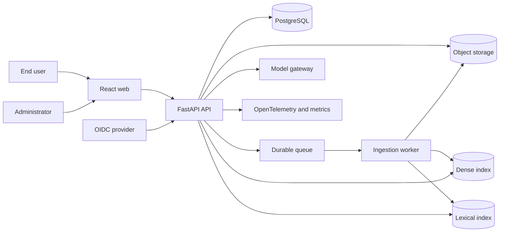

# System architecture

The product is a modular FastAPI application plus independently scalable ingestion workers.
LlamaIndex is used for deterministic workflow and transformation primitives behind project
ports; no global provider settings are used.

Every query resolves an immutable assistant version, compiles an authorization scope, runs
dense and lexical retrieval with pre-filtering, fuses and reranks candidates, validates
active versions, and only then synthesizes. Citation sources are reauthorized when opened.

Ingestion writes both indexes to staging. Database and active-version pointers switch only
after parsing, chunking, embedding, both index writes, and verification succeed. Deletion and
revocation are high-priority events and retrieval fails closed on stale ACL epochs.
