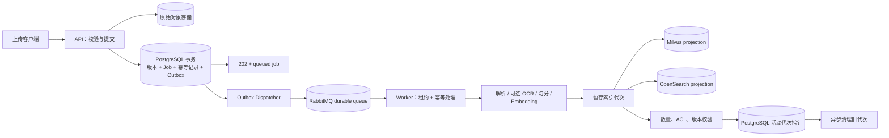

## Context

参见 `proposal.md` 的动机与优先级。本设计只说明如何闭合当前实现与 `specs/enterprise-rag-production-readiness/spec.md` 之间的差距。

当前代码已经具备大部分可复用基础，但关键路径尚未连接成生产语义：

- `api/ingestion.py` 在上传请求内调用 `process_with_retries()`；返回码虽然是 `202`，响应仍等待解析、Embedding 和索引发布。
- `infrastructure/queue.py` 已有进程内队列、RabbitMQ、Outbox 与重试原语；`worker.py` 目前只启动容器并等待停止信号，没有运行 Outbox 分发与入库消费循环。
- 当前 RabbitMQ `get()` 在把消息交给业务处理器前就离开消息处理上下文，无法把 ACK 与业务事务提交绑定，需要先修正投递确认边界。
- 入库任务已保存租户配置版本，但切分器仍在服务构造时使用固定 `512/64`；相同文档内容也缺少独立的“处理代次”来表达重新切分或 OCR 后的新索引。
- PDF 解析只读取原生文本，空白扫描页被跳过；租户配置尚无 OCR、切分或完整检索参数模型。
- 助手版本保存策略与 Provider 引用，但查询只把检索策略版本字符串写入一个带代码默认值的对象；模型运行时也主要来自全局容器设置。
- Provider 的 `stream()` 和 SSE 端点都在完整答案生成后再切片；查询执行和答案在 SSE 建立前已完成并持久化。
- PostgreSQL 迁移已启用并强制 RLS，Compose 也创建了应用角色；现有集成测试只在显式环境变量下运行且覆盖有限，生产发布尚未把账号属性、表所有权、全部受保护表和跨租户写入作为强制证据。
- Milvus/OpenSearch 已保存租户、ACL 和版本元数据，应用也会做部分二次校验；设计必须继续以 PostgreSQL 为事实源，不能通过此次加固把外部索引提升为授权数据库。

现有 API 事件名称、文档版本与最后有效索引语义应尽量保持兼容。数据模型调整采用可向前部署的增量迁移，不能要求一次性停机重建全部文档。

## Goals / Non-Goals

**Goals:**

- 让生产上传请求、Outbox、RabbitMQ 和 Worker 形成可恢复、可横向扩展的完整链路，并把至少一次消息投递收敛为单次业务效果。
- 让 RLS 的真实非特权账号验证成为自动化发布门禁，而不是依赖部署说明或应用层过滤。
- 让模型能力、交付模式、策略来源和配置版本在每个查询或入库任务上可追溯。
- 支持不覆盖当前活动版本的重新切分与 OCR 处理代次，并保留原子发布和回滚。
- 保持 PostgreSQL 权威状态与可重建检索投影之间的明确一致性协议。
- 为每项行为提供单元、集成、契约、故障注入和生产化 smoke 验收路径。

**Non-Goals:**

- 不在本 change 中替换 FastAPI、LlamaIndex Workflow、RabbitMQ、Milvus、OpenSearch 或 PostgreSQL。
- 不把 OCR 扩展为通用视觉理解、版面复原或多模态问答；首期只输出带空间与置信度元数据的文本证据。
- 不保证跨 PostgreSQL、对象存储和两个外部索引的分布式 ACID；通过暂存、权威指针、幂等与补偿实现可恢复一致性。
- 不强制开发和单元测试连接外部模型、OCR 或 RabbitMQ；生产模式的就绪约束与轻量开发模式分开。
- 不在此 change 中归档或重写已有完成 change，也不把运行时加固混入垂直业务能力。

## Architecture

外部索引先完成不可见或非活动的暂存与发布准备，最后由 PostgreSQL 活动代次指针决定何时可被查询使用。即使外部索引留下提前发布或陈旧数据，查询侧仍会按 PostgreSQL 当前状态过滤。

## Decisions

### 1. 按 P0/P1 门禁分阶段交付，而不是一次性切换所有能力

**选择：** 先完成异步入库与 RLS 两项 P0，并要求它们通过生产化验证；随后以独立开关逐项启用真实流式、生产 Provider、版本化切分、OCR 和检索策略闭环。所有开关只用于迁移，最终生产配置不允许回到伪异步或未版本化默认值。

**理由：** P0 直接关系到接口语义、数据隔离和 Worker 可用性，风险高但依赖相对集中。OCR、重新切分和流式生成会扩大数据模型与 Provider 行为面，分阶段能够保留明确回滚点并缩小故障域。

**备选：** 大爆炸式发布能减少过渡代码，但会同时改变上传、数据库角色、索引、模型和配置，无法快速定位回归，故不采用。

### 2. 使用事务 Outbox 完成 API 到 Worker 的可靠交接

**选择：** 上传流程在完成文件策略校验与确定性对象写入后，在同一 PostgreSQL 事务中创建或复用文档版本、入库任务、幂等记录及 `ingestion.process` Outbox 事件；事务提交后即可返回 `202`。消息只携带 `job_id`、`tenant_id`、关联 ID 和必要快照标识，Worker 始终从 PostgreSQL 重新读取权威任务。

Worker 进程以结构化并发运行两个长期循环：

- Outbox Dispatcher 使用行级锁与 `SKIP LOCKED` 批量认领待投递事件，允许多实例并发且不会重复毒化同一记录。
- Queue Consumer 在收到消息后先以租户会话加载任务，再以数据库租约认领；只有任务事务完成后才 ACK，失败则 NACK/重排或由数据库的 `next_attempt_at` 控制重试。

队列端口改为返回带显式 `ack()` / `nack()` 生命周期的 delivery，而不是在 `get()` 返回时自动确认。生产 `queued` 模式要求 durable queue；进程内队列只用于单进程测试或开发 harness。API 不直接发布队列消息，从而避免“数据库提交成功但消息丢失”或相反的双写窗口。

对象存储无法参与 PostgreSQL 事务。原始对象使用文档版本派生的确定性键写入；数据库事务失败时由短保留期 orphan sweeper 清理未被任何版本引用的对象。未提交任务绝不因对象已存在而对用户可见。

**备选：**

- 直接在 API 提交数据库后发布 RabbitMQ 会留下不可恢复双写窗口，拒绝。
- 仅轮询 `ingestion_jobs` 可以减少 RabbitMQ 依赖，但会放弃现有 Outbox/队列基础和优先级、背压能力，拒绝。
- 继续在 API 内处理无法满足 `202` 契约和横向扩展目标，仅保留为非生产迁移回退且不得被报告为生产就绪。

### 3. 以任务租约和处理代次实现幂等、重试与原子索引发布

**选择：** 为任务增加认领与恢复信息，例如 `claimed_by`、`lease_expires_at`、`next_attempt_at` 和最后心跳；状态转换通过条件更新完成，只有当前租约持有者能写入运行阶段。Worker 在解析、OCR、Embedding、每个索引暂存和发布切换前检查取消标志，长阶段定期续租。

新增独立的文档索引处理代次，至少关联：

- 权威文档内容版本；
- 租户配置版本与处理策略哈希；
- Chunk、Embedding、OCR 和 Parser 组件版本；
- dense/lexical 暂存与发布状态；
- 创建原因（首次入库、内容更新、重新切分、OCR 重建或修复）。

Chunk 与外部索引元数据增加 `index_generation_id`。同一内容版本可以因为切分或 OCR 配置变化产生新代次，而无需伪造新的内容版本。发布顺序为：写入 PostgreSQL 暂存代次和 Chunk → 暂存 dense/lexical 投影 → 校验数量、ACL 和版本 → 使外部投影可查询 → 在短事务中切换 PostgreSQL 活动代次指针。查询只接受当前活动代次，因此最后一步失败时提前可见的外部数据仍被忽略并可异步清理。

确定性 Chunk/投影键包含处理代次，重复执行会覆盖或复用同一暂存对象。配额消耗、审计和终态写入使用任务或尝试标识防重。

**备选：** 为每次重新切分复制一个相同内容哈希的 `DocumentVersion` 会混淆“源内容变化”和“处理策略变化”，破坏版本解释，因此新增处理代次。依靠消息 ID 在 RabbitMQ 中做到 exactly-once 不现实，因此采用至少一次投递与业务幂等。

### 4. 把数据库身份属性与 RLS 覆盖率做成可执行门禁

**选择：** 使用独立配置项提供迁移数据库 URL 和应用数据库 URL。迁移由一次性 migration job 或部署步骤使用拥有 DDL 的角色执行；API 与 Worker 进程只接收应用 URL。应用角色显式设置 `NOSUPERUSER NOBYPASSRLS NOINHERIT`，不拥有受保护表，只获得所需 DML、序列和 schema 权限；迁移角色或专用 owner 拥有对象。

新增生产预检与集成测试，基于迁移中维护的受保护表清单验证：

- 当前应用角色的 `rolsuper`、`rolbypassrls`、继承属性和成员关系；
- 所有租户表已启用并强制 RLS、存在同时约束 `USING` 与 `WITH CHECK` 的租户策略；
- 应用角色不是这些表的 owner；
- 无租户上下文时读写均失败；
- 两个租户上下文下的 SELECT、INSERT、UPDATE、DELETE 和直接主键读取均无法跨界；
- 连接池归还后不会残留前一个事务的租户上下文。

测试连接与凭证完全由环境提供，不再硬编码主机、端口或测试密码。生产启动可以做无破坏的角色/策略自检，带数据的跨租户验证放在部署 smoke 中；任一检查失败即阻止发布。

**备选：** 只依赖应用查询附加 `tenant_id` 条件无法防止遗漏过滤；只设置 `FORCE ROW LEVEL SECURITY` 也不能约束超级用户或绕过账号；两者都不能替代非特权账号实测。

### 5. 让助手版本解析实际 Provider，并区分 streaming 与 buffered

**选择：** 查询开始时由助手活动版本解析不可变 Provider Profile，而不是始终使用容器级全局模型。解析过程验证租户归属、状态、Secret Binding、外联策略和能力声明，并生成 `EffectiveModelSnapshot`；查询记录保存 Profile 版本、模型、能力、配置哈希与实际回退链。全局 `RAG_MODEL_BACKEND` 仅作为开发 bootstrap 或明确的系统默认 Profile 来源，不能在生产中静默覆盖助手配置。

模型端口区分完整生成与真实增量事件。流式事件至少包含文本 delta、Provider/模型、结束原因和最终 usage；OpenAI-compatible 适配器使用上游流式协议，不先调用完整 completion。Gateway 只允许在首个 delta 发出前重试或切换回退；一旦客户端看见内容，中途失败不得从头重放另一个回答。

查询服务新增事件驱动的执行入口：先创建运行中的查询记录并完成授权检索，再根据 Provider 能力选择 `streaming` 或 `buffered` 合成，将事件交给 SSE 端点，最终统一完成输出校验、引用持久化和唯一终态转换。现有 `query`、`answer`、`citation`、`terminal` 事件名称保持兼容，在首个 `query` 事件中增加 `delivery_mode` 和能力快照标识。

真实流式与输出安全存在天然冲突，因此采用两级策略：

- 可增量执行的凭据/敏感数据规则在每个 delta 进入客户端前运行，并保留跨 delta 的有限窗口，防止敏感模式被拆开绕过。
- 需要完整答案才能判断的策略把该次查询强制标记为 `buffered`，完整验证后再交付；系统不得把它标记为 streaming。

取消通过断开 Provider 响应流和取消生成任务向下传播。终态使用条件更新保证只有一个执行者能从 `running/streaming` 转为 `success/refusal/degraded/failed/cancelled`。部分输出失败时只保存受内容捕获策略允许的诊断摘要，不创建成功答案。

**备选：** 继续完整生成后切片只是 UI 动画而非真实流式；无条件直接转发 Provider delta 会在最终护栏发现问题前泄露内容；二者都不采用。

### 6. 将入库与检索参数解析为版本化有效快照

**选择：** 把租户配置演进到兼容的新 schema 版本，增加 `ingestion` 配置组，包含切分边界、OCR 模式、Provider、阈值与资源上限。旧配置读取时由一个有名称、有版本、可记录哈希的兼容默认策略补全；补全结果写入任务快照，不能只存在于 Python 默认参数中。

入库任务提交后始终使用其快照，即使租户激活新配置。配置激活只影响新任务；管理员通过显式重建操作为既有内容创建新处理代次。重建遵循普通配额、并发、取消、暂存和原子发布规则，并支持按空间、数据源或文档分批执行。

检索侧新增 `EffectiveRetrievalPolicyResolver`，从助手版本引用的租户策略记录解析全部有效字段：dense/lexical top-k、fusion k、rerank top-k、evidence top-k、相关性阈值、上下文预算与单路降级。缺失的可选字段从被引用的版本化默认策略继承；策略不存在、跨租户、未激活或能力不兼容时在搜索前失败。查询记录保存策略 ID、版本、哈希、继承来源和全部有效值。

**备选：** 只把 `chunk_size` 加入环境变量仍然不能按租户隔离，也无法解释历史任务。继续用 dataclass 代码默认值补齐策略会使行为随部署代码变化而无法复现，故拒绝。

### 7. OCR 作为解析后的受控补充阶段

**选择：** 在项目自有端口中定义 OCR Adapter，输入受支持页面图像，输出文本区域、页码、坐标、置信度、语言、Provider 与版本。结构解析器负责返回原生文本和页面诊断，入库编排器根据租户策略及最小文本阈值决定是否对空白或低文本页面调用 OCR；不把特定 OCR SDK 直接嵌入 PDF 解析器。

首期支持三种模式：

- `disabled`：不调用 OCR，行为与当前实现兼容；
- `best_effort`：合并成功 OCR 与原生文本，失败页产生降级诊断；
- `required`：任何策略要求的页面失败都会使处理代次失败并保留旧活动代次。

远程 Adapter 在调用前再次校验租户允许的 Provider、外部网络、Secret Binding、内容捕获和配额；本地 Adapter 仍受文件大小、页数、并发、超时和资源上限约束。OCR 文本沿用原始对象和页面作为引用目标，metadata 标记来源、置信度与区域，低置信度内容可被检索策略降权或排除。Provider 依赖放入可选安装组，基础开发环境不被强制拉入重型 OCR 运行时。

**备选：** 对所有文档无条件 OCR 会增加成本、延迟和隐私暴露；把 OCR 文本当成无来源纯文本会破坏引用可信度；两者都拒绝。

### 8. 通过权威指针、查询后二次校验和对账保持事实源边界

**选择：** PostgreSQL 保存并决定租户状态、成员关系、ACL epoch、活动内容版本、活动索引代次、配置与策略版本。Milvus/OpenSearch 文档必须携带这些标识和 `published` 状态，但只能做候选召回。

检索流程保留两层控制：

1. 在外部搜索请求中下推租户、知识空间、ACL、活动代次和发布过滤，减少不合格候选。
2. 在组装模型上下文前，按候选 ID 批量查询 PostgreSQL，重新验证当前租户、空间权限、ACL epoch、文档状态、活动版本和活动处理代次；引用访问时再次执行相同权威检查。

发现陈旧候选时丢弃结果并记录按索引、租户、文档和原因分类的指标/事件。对账任务从 PostgreSQL 枚举活动代次，比较 dense/lexical 数量与关键元数据，按确定性键补写或重建投影。PostgreSQL 权威查询不可用时检索失败关闭；单个外部索引不可用时是否单路降级仍由版本化检索策略决定。

**备选：** 仅信任索引中的 `active` 或 ACL 字段延迟低，但撤权、删除和发布切换存在传播窗口，不能满足企业权限要求。

### 9. 统一生产就绪证据与可观测信号

**选择：** 每项能力同时提供自动化测试和运行证据，关联同一个 correlation/job/query ID。最少增加以下信号：

- Outbox pending/poisoned、队列积压、消息投递与 ACK 延迟、Worker 租约恢复、任务阶段耗时和重复投递收敛次数；
- RLS 账号属性、表覆盖率和 smoke 结果，但不记录数据库凭证；
- 回答 `delivery_mode`、首 delta 延迟、完整耗时、中途失败、取消传播和实际 Provider/回退；
- 处理配置与检索策略版本/哈希、OCR 页数/失败/成本、索引代次陈旧与对账结果。

发布证据需要证明 P0 在真实 Compose/PostgreSQL/RabbitMQ/Worker 拓扑上通过，并对 P1 启用项执行相应 Provider 或受控替身的契约测试。普通 readiness 只报告依赖连通性；“生产就绪”门禁额外验证账号、行为和最小真实业务路径，避免把绿色健康检查等同于可用功能。

**备选：** 只依赖单元测试无法发现角色、网络、队列 ACK 和进程边界问题；只看健康接口又无法证明任务或查询可用，故采用分层证据。

## Risks / Trade-offs

- **[Outbox、队列与业务事务仍可能重复交付]** → ACK 绑定任务事务、数据库租约、确定性处理代次和副作用防重；使用故障注入验证 API/Worker 在每个提交边界退出。
- **[对象存储写入与数据库提交无法原子化]** → 使用确定性对象键、未引用对象保留窗口与 orphan sweeper；数据库事务未提交时不暴露任务。
- **[真实流式可能在完整输出校验前暴露内容]** → 增量护栏先于转发；需要全量判断的策略强制 buffered，并在协议中诚实标注模式。
- **[首个 delta 后无法安全切换 Provider]** → 只在首 delta 前重试或回退；中途失败发唯一失败/降级终态，不拼接两个 Provider 的答案。
- **[重新切分与 OCR 会造成索引和成本峰值]** → 通过新处理代次、分批重建、租户配额、并发上限、背压与旧代次延迟清理限制峰值。
- **[OCR 可能产生错误文本或泄露原文]** → 保存置信度与来源、支持阈值和 required/best-effort 模式；远程调用必须通过租户外联、Secret、内容捕获和审计策略。
- **[RLS 门禁可能暴露现有部署角色配置错误并阻止启动]** → 提供独立预检、明确迁移账号/运行账号模板和 staging 演练；不为通过门禁而允许特权运行账号。
- **[新增处理代次增加查询与清理复杂度]** → 把活动代次指针集中在 PostgreSQL，外部索引只保存投影；先做向后兼容读取，再逐步重建。
- **[一个 change 横跨多个子系统]** → 任务按 P0/P1、迁移开关和独立验收点拆分；每个阶段都要求可回滚且不得提前勾选后续能力。

## Migration Plan

1. **基线与预检**
   - 固化当前上传、任务、查询 SSE、RLS 与索引发布行为测试，记录 P0/P1 失败基线。
   - 增加数据库角色/表策略只读预检，先在现有 Compose 与 staging 输出诊断，不立即阻断。

2. **P0 数据库与 Worker 向前兼容部署**
   - 以增量迁移增加任务租约、重试调度、处理代次、活动代次指针及必要索引；旧代码可忽略新字段。
   - 修正消息 delivery/ACK 契约，部署能运行 Dispatcher 与 Consumer 的 Worker；在尚未产生 `ingestion.process` 事件时验证空载和恢复。
   - 让上传事务写入 Outbox，并在 staging 把执行模式切到 `queued`；验证 API 快速返回、API 退出、Worker 重启、重复投递、取消、失败回滚和队列积压。
   - 生产切换前确认至少一个 Worker 可消费且 Outbox/queue 指标可见。切换后生产校验拒绝 `inline` 与进程内队列组合。

3. **P0 RLS 门禁**
   - 把迁移 URL 与运行 URL 从进程配置和部署密钥层面分开，确保 API/Worker 容器拿不到迁移凭证。
   - 以非 owner、非 superuser、非 bypass 运行账号执行完整读写 RLS 契约测试和生产 smoke；通过后把预检从告警改为阻断。

4. **P1 版本化策略与处理代次**
   - 引入兼容的新租户配置 schema 和有版本的默认处理/检索策略，旧配置解析后行为保持 `512/64`、OCR disabled 和当前检索参数，但来源可追溯。
   - 新任务写入完整有效快照；查询改为解析助手引用的 Provider/检索策略并记录哈希。
   - 提供按租户/空间/文档的显式重建命令或管理任务，先在小样本验证新旧代次原子切换，再分批处理存量数据。

5. **P1 OCR 与真实流式**
   - 先部署 OCR 端口、策略和 disabled 默认；使用扫描件基准验证 best-effort/required、引用页码、成本和外联拒绝，再由租户选择启用。
   - 保持现有 SSE 事件名，先增加 `delivery_mode`；实现真实 Provider 流和增量护栏后按 Provider Profile 启用。需要全量护栏的策略保持 buffered。
   - Compose/staging 不再把 `extractive` 当作生产配置证据；production 环境缺少显式生成式 Provider 时门禁失败。

6. **完成对账与发布证据**
   - 执行陈旧索引注入、PostgreSQL 中断、单索引中断、OCR 失败、流式中断和撤权后的引用访问测试。
   - 运行完整后端、前端、迁移、类型、静态检查、真实 Compose smoke 与非特权 RLS 套件，保存不含 Secret 的结果摘要。

**Rollback:**

- 所有数据库迁移先保持 additive；旧字段和旧读取路径至少保留一个发布周期，不在本 change 首次上线时删除。
- 异步链路回滚前先停止新 Outbox 生产，暂停 Dispatcher 并盘点/排空或安全停放待处理消息；不得在未处理消息仍可能交付时同时恢复 inline 处理。
- 新处理代次出现质量问题时，将 PostgreSQL 活动代次指针回切旧代次并异步撤销新投影；原始内容版本不变。
- OCR 可按租户切回 disabled；真实流式可切到诚实的 buffered 模式，但生产不得恢复“完整答案后伪分片”。
- Provider 配置可回滚到上一个已验证 Profile；若生产没有可用生成式 Profile，服务应报告未就绪或降级，而不是静默使用 extractive 冒充生产模型。
