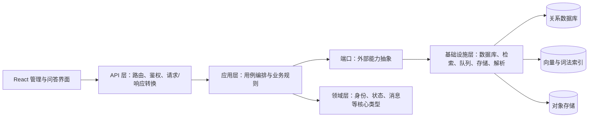

# 项目代码结构

## 1. 项目定位

`enterprise-rag-assistant` 是一个面向企业知识库的 RAG（检索增强生成）系统。项目以 FastAPI
提供服务端接口，以 React/Vite 提供管理和问答界面；通过清晰的端口与适配器边界隔离
LlamaIndex、模型、检索、对象存储和消息队列等外部实现。

系统的关键约束是：多租户隔离、按权限检索、基于证据生成并附带引用、配置与评测版本化，以及
摄取任务的可追踪和可恢复。

## 2. 顶层目录

```text
.
├── backend/                 # Python 后端与领域实现
│   └── enterprise_rag/
├── web/                     # React/Vite 单页管理界面
├── alembic/                 # 数据库迁移脚本
├── tests/                   # 单元、接口与集成测试
├── evaluation/              # 通用语料评测集
├── scripts/                 # 基准测试等辅助脚本
├── deploy/                  # Kubernetes 与可观测性部署资料
├── docs/                    # 架构、运维、质量与安全文档
├── openspec/                # 需求变更的规格、设计与任务清单
├── compose.yaml             # 本地集成环境依赖
├── pyproject.toml           # 后端依赖、测试、静态检查配置
└── README.md                # 快速启动与验证说明
```

## 3. 后端分层



### `backend/enterprise_rag/api/`

HTTP 边界层，负责 FastAPI 路由、请求模型、依赖读取和响应序列化。

- `auth.py`：OIDC 令牌校验及角色解析。
- `health.py`、`telemetry.py`、`audit.py`：健康检查、运行遥测和审计查询。
- `knowledge.py`：知识空间、成员关系与数据源管理。
- `ingestion.py`：上传、摄取任务、预览、下载和删除接口。
- `configuration.py`：策略、供应商配置、助手草稿与版本管理。
- `chat.py`：流式问答（SSE）和引用内容读取。
- `evaluation.py`：评测集、评测运行、质量门禁和人工反馈。
- `errors.py`：统一的业务异常响应格式。

### `backend/enterprise_rag/application/`

应用用例层，组织权限检查、状态迁移、事务内写入与审计记录。

- `knowledge.py`：知识空间与数据源生命周期。
- `ingestion.py`：文件校验、解析、分块、嵌入、双索引暂存/发布及回滚。
- `retrieval.py`：查询标准化、会话追问改写、混合检索、RRF 融合与重排。
- `query.py`：基于 LlamaIndex `Workflow` 的“输入护栏 → 检索 → 生成 → 校验”问答流。
- `assistants.py`、`configuration.py`：不可变助手版本、策略与供应商配置。
- `providers.py`：适配器注册表、默认抽取式模型和带限流/熔断/重试的模型网关。
- `security.py`：数据库权限校验与检索权限范围编译。
- `evaluation.py`：评测执行、门禁判定、覆盖理由和反馈记录。
- `audit.py`、`guardrails.py`：哈希链审计与内置内容护栏。
- `ports.py`：数据库、存储、队列、解析、检索、模型等依赖的协议定义。

### `backend/enterprise_rag/domain/`

`types.py` 集中定义稳定 ID、哈希、时间、角色、生命周期状态、请求身份、授权范围及队列消息等
跨层共享类型；该层不依赖 FastAPI 或具体基础设施。

### `backend/enterprise_rag/infrastructure/`

外部能力的本地实现与持久化模型。

- `orm.py`：SQLAlchemy 表模型，涵盖租户、文档、助手、会话、评测、审计和发件箱。
- `database.py`：异步引擎、会话工厂、仓储和工作单元。
- `search.py`：内存向量检索、词法检索、ACL 过滤与重排器。
- `object_store.py`：租户隔离的本地对象存储。
- `parsers.py`：格式白名单解析器（文本、HTML、Office/PDF 等按可选依赖启用）。
- `queue.py`：进程内优先级队列、事务发件箱及分发循环。
- `secrets.py`、`limits.py`、`redaction.py`、`telemetry.py`：密钥解析、限流、脱敏和指标事件。
- `container.py`：依赖装配、开发环境默认实现和就绪状态检查。

### 入口文件

- `main.py`：创建 FastAPI 应用，注册中间件、路由、指标和生命周期。
- `worker.py`：启动摄取任务处理循环。
- `config.py`：从环境变量读取配置，并执行运行时配置校验。

## 4. 两条主要业务链路

### 文档摄取

`上传接口` → `IngestionService.submit_upload` → 写入对象存储、文档版本和发件箱消息 →
`worker` 消费任务 → 解析 → 分块 → 嵌入 → 向量/词法索引暂存 → 校验 → 同时发布两类索引 →
切换活动版本并记录审计事件。

失败时，流程标记失败原因；若已开始发布，会尽力恢复上一活动版本。删除或撤权会提升 ACL 世代，
避免旧权限范围继续命中索引。

### 受控问答

`聊天接口` → 解析身份和助手活动版本 → 编译授权范围 → `GroundedQueryWorkflow`：

1. 检查用户输入护栏；
2. 对授权知识空间执行向量与词法检索、融合、重排；
3. 过滤不安全证据，处理证据冲突；
4. 向模型传递仅含已授权证据的上下文；
5. 检查生成内容、持久化回答与引用；
6. 再次确认引用仍指向活动文档版本后才返回结果。

## 5. 前端与部署

- `web/src/App.tsx`：单页面四个工作区——问答、知识空间、助手配置、质量评测。
- `web/src/api.ts`：后端 REST/SSE 客户端和请求错误处理。
- `web/src/styles.css`：应用视觉样式。
- `compose.yaml`：PostgreSQL、MinIO、RabbitMQ、Redis、Qdrant、OpenSearch 和 Keycloak 的本地集成基线。
- `deploy/`：Kubernetes 清单和 Prometheus 告警规则。

## 6. 验证入口

后端质量门禁在 `pyproject.toml` 中配置：`pytest`、`ruff` 和 `mypy`；前端在 `web/package.json`
中配置 TypeScript 与 ESLint 检查。测试按 `unit/`、`api/`、`integration/` 分层，覆盖权限、摄取
原子性、检索质量、失败恢复、审计和评测门禁。
